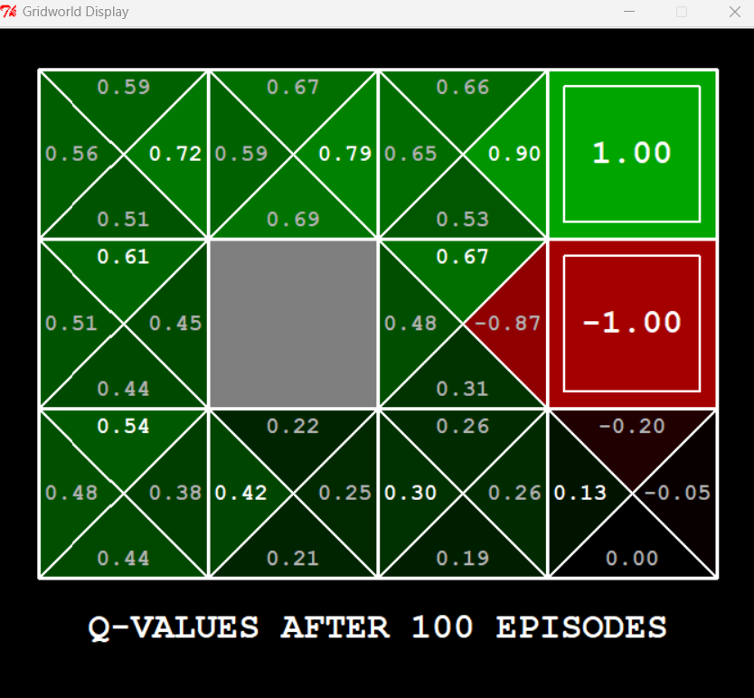
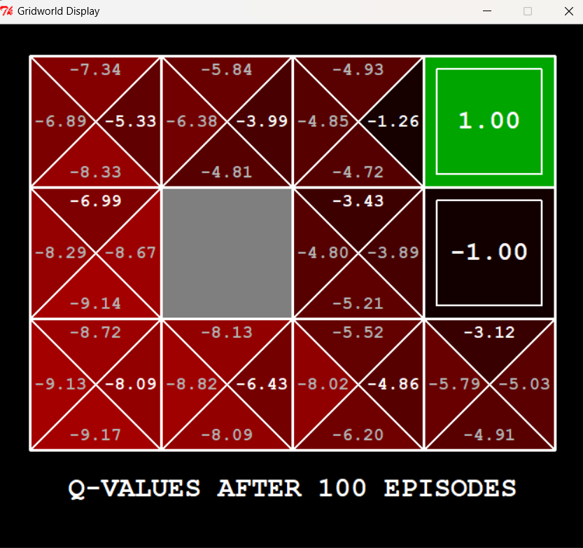

# Q-Learning Implementation in GridWorld

This project is part of the UC Berkeley CS188 Artificial Intelligence course assignments. The implementation focuses on Q-learning in a GridWorld environment.

## Attribution
This project was developed at UC Berkeley:
- Core projects and autograders were primarily created by John DeNero and Dan Klein
- Student side autograding was added by Brad Miller, Nick Hay, and Pieter Abbeel
- Source: http://ai.berkeley.edu

## Project Structure

Modified file:
- `qlearningAgents.py`: Contains our Q-learning agent implementation (only file modified)

Original UC Berkeley files (unchanged):
- `gridworld.py`: The GridWorld environment
- `learningAgents.py`: Base class for reinforcement learning agents
- `util.py`: Utility functions and data structures
- `game.py`: Core game mechanics

## Implementation Details

The Q-learning agent (`QLearningAgent` class in `qlearningAgents.py`) implements these key methods:

1. `__init__`: Initializes Q-values storage
2. `getQValue`: Returns Q-value for a state-action pair
3. `computeValueFromQValues`: Computes maximum Q-value for a state
4. `computeActionFromQValues`: Determines best action in a state
5. `getAction`: Implements epsilon-greedy action selection
6. `update`: Updates Q-values using the Q-learning formula
7. `pseudo-code` : Contains the pseudo-code for the code

## Demo Results

### Default Settings (No Living Reward)

- Command: `python gridworld.py -k 100 -a q -s 2000`
- Shows positive Q-values (green) with clear gradient toward +1.00 reward
- Values increase along optimal path: 0.54 → 0.61 → 0.72 → 0.79 → 0.90 → 1.00

### With Negative Living Reward

- Command: `python gridworld.py -k 100 -a q -s 2000 -r -4`
- Shows negative Q-values (red) due to step costs
- Agent finds shortest path to minimize negative rewards

## How to Run

### Requirements
- Python 2.7
- No additional packages required

### Basic Commands

1. Run GridWorld with default settings:
```bash
python gridworld.py -k 100 -a q -s 2000
```

2. Run with negative rewards (for shorter paths):
```bash
python gridworld.py -k 100 -a q -s 2000 -r -4
```

### Command Parameters
- `-k`: Number of episodes
- `-a q`: Use Q-learning agent
- `-s`: Random seed
- `-r`: Living reward (cost per step)

## Understanding the Display

- Each cell shows Q-values for different directions
- Green cells: Higher (better) values
- Red cells: Lower (worse) values
- Gray cell: Wall (obstacle)
- Terminal states: Fixed rewards (+1.00 and -1.00)

## Parameters

Key learning parameters:
- `epsilon`: Exploration rate
- `alpha`: Learning rate
- `gamma`: Discount factor

These can be modified to change the agent's learning behavior. 
